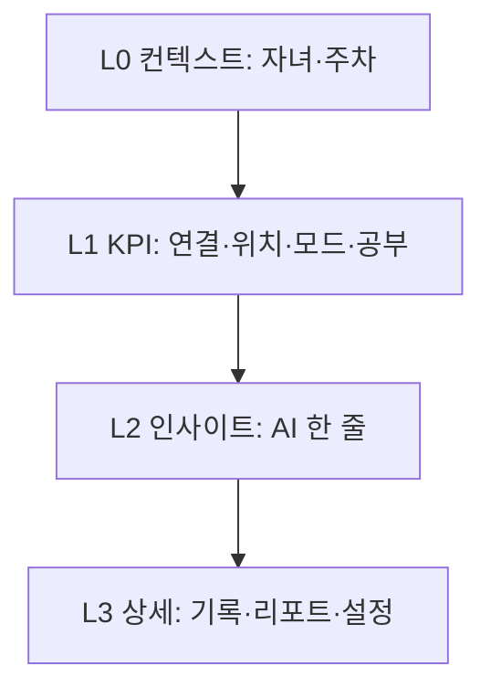
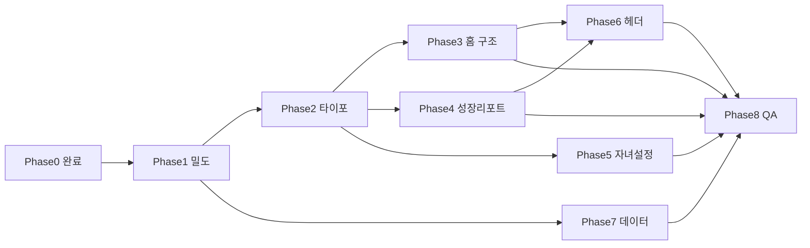

# 학부모 페이지 UX 정제 — 실행 계획

> **구현 상태 (2026-05-16):** Phase 1–8 클라이언트 반영 완료. 하단 탭·성장 리포트 nav 추가는 의도적으로 하지 않음.  
> **톤앤매너:** 학생 화면과의 시각 정렬은 [`APP_TONE_AND_MANNER.md`](./APP_TONE_AND_MANNER.md) 참고.

# 학부모 페이지 UX 정제 — 단계별 실행 계획

## 목표와 원칙

**목표:** 학부모 화면을 「읽는 앱」에서 **「3초에 상태를 파악하는 대시보드」**로 전환한다.

**정보 위계 (고정):**



**범위 밖 (의도적 유지 — 변경하지 않음)**

- 학부모 하단 탭 미노출 ([`App.tsx`](src/App.tsx) `!parentView` 조건)
- 성장 리포트 전용 진입 경로 추가 (URL `#/parent/analysis`·알림 딥링크만 유지)

**이미 반영된 기반 작업 (Phase 0)**

| 항목 | 파일 |
|------|------|
| 연결 상태 배지+상세 | [`ParentHomeTab.tsx`](src/coach/parent/ParentHomeTab.tsx) |
| AI 가이드 주차 라벨 | 동일 + [`ko.json`](src/coach/fallbacks/ko.json) |
| 현재 공부 상태 구분 | `ParentHomeTab` |
| 빈 요일 숨김·주간 empty | [`ParentRecordsWeekSection.tsx`](src/coach/parent/ParentRecordsWeekSection.tsx) |
| 성장 리포트 sparse·0% 맥락 | [`ParentGrowthReportTab.tsx`](src/coach/parent/ParentGrowthReportTab.tsx), [`server/index.js`](server/index.js) |
| 분석 화면 뒤로가기·본문 학생선택 제거 | [`App.tsx`](src/App.tsx), [`ParentCoachApp.tsx`](src/coach/parent/ParentCoachApp.tsx) |

---

## Phase 1 — 콘텐츠 밀도 즉시 감소 (1~2일)

**목표:** 코드 구조 대변경 없이 **글자량 40%↓**, tinted box 중복 제거.

### 1.1 홈 — AI 가이드 「한 줄 + 더보기」

- **파일:** [`ParentHomeTab.tsx`](src/coach/parent/ParentHomeTab.tsx), [`ko.json`](src/coach/fallbacks/ko.json)
- **구현:**
  - `suggestedPhrase`에서 첫 문장(또는 80자)만 `parent-home__insight-headline`으로 표시
  - `더보기` 토글 시 전체 `summary_text` 펼침 (`useState` + `aria-expanded`)
  - 카드 제목 `SNU AI 학부모 가이드` → 짧은 라벨 `이번 주` 또는 제목 제거(주차 라벨만 유지)
- **스타일:** 본문 `font-weight: 400`, headline만 `600` ([`styles.css`](src/styles.css) `.parent-home__coach-phrase` 분리)

### 1.2 홈 — MDM/연결을 KPI 칩 1줄로 통합

- **현재:** AI 카드 + 연결 카드 2개
- **변경:** 상단 `parent-home__kpi-strip` (flex, 가로 스크롤)
  - 칩 예: `연결 필요` | `체크아웃` | `기본·계획표` | `공부 시간外`
  - MDM 상세(`simpleMdmNetworkDescription`)는 칩 탭 → bottom sheet 또는 기존 `dday-modal` 패턴
- **삭제:** `parent-home__net-status-card` 단독 카드
- **문구:** 기술 문구(`Simple MDM(API)...`)는 모달 전용, 칩에는 4~8자 라벨만

### 1.3 홈 — 4분할 카드 위계

- **파일:** `ParentHomeTab.tsx`, `styles.css`
- **변경:**
  - 상태값(체크아웃, 21:00, 과목명) → `.parent-type-kpi` (22~24px bold)
  - 카드 제목(실시간 위치 등) → `.parent-type-section` (12px muted)
  - `parent-home__planner-hint` 제거 → 계획표 카드 ⓘ 버튼 1개
  - primary 버튼: 카드당 1개 유지, 보조 액션은 `coach-ghost-btn` 또는 text link

### 1.4 성장 리포트 — narrative 박스 1개로 합치기

- **파일:** [`ParentGrowthReportTab.tsx`](src/coach/parent/ParentGrowthReportTab.tsx)
- **현재:** summary 카드 + `sparse-notice` + energy callout + section callout
- **변경:**
  - 상단 **단일** `parent-growth-report__insight` (weeklySummary 1~2문장)
  - `lifeDataSparse`일 때 같은 박스 안 1줄 캡션만 추가 (별도 보라 박스 삭제)
  - `energyParentTip`, `studyEfficiencyInsight` → **접힌** `코치 코멘트` 아코디언 (`<details>` 또는 기존 modal 패턴)
- **배지:** 긴 문장 배지 금지
  - `계획 추이 비교용 지난주 데이터 없음` → `전주 비교 없음`
  - `수면 데이터 수집 중` 유지 (짧음)

### 1.5 성장 리포트 — empty 차트 단순화

- **변경:** 7× `기록 없음` 그리드 대신
  - 차트 영역 공통 `parent-growth-report__chart-empty` 1블록
  - 데이터 있을 때만 sleep-grid / stress-row 렌더
- **헤더:** `subtitle`과 `headerBadgeWeek` 중복 제거 (날짜는 한 곳만)

### 1.6 검증

- Playwright 또는 수동: 홈·analysis viewport 스크린샷, `main.innerText` 줄 수 전후 비교 (기준: analysis 59줄 → 35줄 이하 목표)

---

## Phase 2 — 타이포·디자인 토큰 (1일)

**목표:** 학부모 전역에서 **역할 기반** 스타일만 사용.

### 2.1 CSS 토큰 추가

- **파일:** [`styles.css`](src/styles.css) (`.app-root--parent` 블록 근처)

```css
/* 제안 클래스 */
.parent-type-kpi { font-size: calc(22px * var(--parent-ui-scale)); font-weight: 700; ... }
.parent-type-section { font-size: 12px; font-weight: 500; color: var(--text-muted); ... }
.parent-type-body { font-size: 14px; font-weight: 400; line-height: 1.5; ... }
.parent-type-caption { font-size: 12px; color: var(--text-muted); ... }
```

### 2.2 기존 클래스 매핑

| 기존 | 변경 |
|------|------|
| `.parent-home__coach-phrase` (600) | body는 400, headline만 600 |
| `.parent-home__status-card-title` | section |
| `.parent-home__status-body` | kpi 또는 muted |
| `.parent-growth-report__summary-text` | body |
| `.parent-growth-report__h2` | section + 상단 margin 통일 |

### 2.3 Tinted box 규칙

- 페이지당 tinted background 박스 **최대 1개** (인사이트 전용)
- callout `--warm` / `--cool` → 아코디언 내부로 이동

---

## Phase 3 — 홈 대시보드 구조 리팩터 (2~3일)

**목표:** [`ParentHomeTab.tsx`](src/coach/parent/ParentHomeTab.tsx) (~990줄)를 섹션 컴포넌트로 분리.

### 3.1 신규 컴포넌트

| 컴포넌트 | 책임 |
|----------|------|
| `ParentHomeKpiStrip.tsx` | 연결·위치·모드·공부 칩 |
| `ParentHomeInsight.tsx` | AI 한 줄 + 더보기 |
| `ParentHomeControlGrid.tsx` | 2×2 제어 카드 (기존 grid) |
| `ParentRecordsWeekSection.tsx` | 유지 (Phase 1 empty 이미 적용) |

### 3.2 레이아웃 순서 (고정)

1. KpiStrip  
2. Insight  
3. ControlGrid  
4. Records (기본 **접힘**, `localStorage` 키 `parent-records-expanded`)

### 3.3 데이터

- KpiStrip 값은 기존 `deviceSnapshot`, `studyRoomLiveStatus`, `currentStudyDisplay` 재사용
- 추가 API 없음

---

## Phase 4 — 성장 리포트 에디토리얼 레이아웃 (2일)

**목표:** [`ParentGrowthReportTab.tsx`](src/coach/parent/ParentGrowthReportTab.tsx) 스캔 가능한 리포트.

### 4.1 헤더 툴바

- `header-top`: 한 줄 — `주차 라벨` | spacer | `PDF` | `‹ ›`
- `h1` 제목: `성장 리포트`만 (학생 이름은 헤더 selector와 중복 최소화 → `정현우 · 성장 리포트` 또는 이름 생략)

### 4.2 섹션 순서

1. Insight (단일)  
2. KPI 칩 2~3개 (학습 h, 집중 %, 계획 달성) — 숫자 우선  
3. 차트 (수면·스트레스) 또는 unified empty  
4. 학습 효율 (바 + 도넛, 맥락 캡션 유지)  
5. 계획 실행력  
6. 다음 주 제안 (접기 가능)

### 4.3 서버 (선택, Phase 4 말)

- [`server/prompts/parentGrowthReport.js`](server/prompts/parentGrowthReport.js): 섹션별 max 문장 수 명시 (summary 2문장, energy 2문장)

---

## Phase 5 — 자녀 설정 리스트 UI (2~3일)

**목표:** [`StudentSettingsTab`](src/coach/parent/ParentCoachApp.tsx) (L1752~) 반복 카드 제거.

### 5.1 상단 상태 배너 (유지·축소)

- 2문장 → **1문장** + 강조 단어만 kpi 색: `기본 모드 · 계획표 작성 중`

### 5.2 설정 리스트

- iOS `settings-item` 패턴 재사용 ([`StudentProfilePage`](src/components/student/StudentProfilePage.tsx) 참고)
- 행 구성: `학습 위치` | 부가값 | `›`
- 행 구성: `계획표 작성` | 21:00 켜짐 | `›`
- 행 구성: `허용앱·시간표` | 요약 | `›`

### 5.3 상세 진입

- `허용앱·시간표` 탭 → 기존 [`ModeScheduleSettings`](src/coach/parent/ModeScheduleSettings.tsx) 모달/풀페이지
- `지금 켜기` / 모드별 설명 문장 3개 삭제 → 상세 화면 1회 안내

### 5.4 홈과 중복

- 홈 계획표 카드는 **빠른 토글**만; 세부는 자녀 설정 행 링크 (`setCoachParentTab("studentSettings")`)

---

## Phase 6 — 공통 헤더·내비 톤 (1일)

**파일:** [`App.tsx`](src/App.tsx), `styles.css`

- `parent-quick-nav`: 텍스트 3개 → **아이콘+라벨** 또는 opacity 0.7 기본 / active만 1.0
- 학생 selector: 유일한 filled pill 유지
- 성장 리포트: `h1`과 헤더 중복 줄이기 (Phase 4와 연동)

---

## Phase 7 — 데이터·AI 정합 (1~2일)

**문제:** AI 가이드 본문 `2026-05-09 ~ 05-11` vs UI 주차 `5/11~5/17` 불일치.

### 7.1 클라이언트

- [`ParentCoachApp.tsx`](src/coach/parent/ParentCoachApp.tsx) `pickParentSuggestedPhrase`: 표시용 headline 생성 시 **주차 라벨만** prefix
- full text는 더보기 안에서만; 날짜 불일치 시 headline은 `deriveGuide` fallback 우선

### 7.2 서버 (권장)

- [`parentDailyAiReport`](server/prompts/parentDailyAiReport.js) / 일일 리포트 생성: `report_date`·`weekStart`를 prompt에 명시
- [`buildParentGrowthReportPayload`](server/index.js): narrative 생성 input에 `weekKeys` 일치 검증

### 7.3 copy inventory

- 변경 문자열 [`ko.json`](src/coach/fallbacks/ko.json) + [`docs/COACH_PROMPTS_AND_KO_INVENTORY.md`](docs/COACH_PROMPTS_AND_KO_INVENTORY.md) 동기화 (사용자 요청 시에만 md 대량 수정)

---

## Phase 8 — QA·문서·출시 (1일)

### 8.1 문서

- 본 계획 전문을 [`docs/PARENT_UX_REFINEMENT_PLAN.md`](docs/PARENT_UX_REFINEMENT_PLAN.md)로 저장 (승인 직후)

### 8.2 테스트 체크리스트

| 시나리오 | 확인 |
|----------|------|
| 홈 첫 로딩 | KPI 칩·한 줄 인사이트·4카드 스캔 |
| 연결 끊김 / MDM 미설정 | 칩+모달, 카드 2장 아님 |
| 성장 리포트 데이터 없음 | empty 1블록, narrative 1박스 |
| 성장 리포트 데이터 있음 | 차트·도넛·접힌 코멘트 |
| 자녀 설정 | 리스트 탭·모달 동작 |
| 학생 전환 | KPI·인사이트 갱신 |

### 8.3 회귀

- `npm run build`, 학부모 role Playwright 스모크 (home / analysis / student-settings)
- **하지 않음:** 하단 탭 추가, 성장 리포트 nav 추가

---

## 의존 관계



**권장 구현 순서:** P1 → P2 → P3 ∥ P4 → P5 → P6 → P7 → P8

---

## 예상 효과 (정량 목표)

| 지표 | 현재(측정) | 목표 |
|------|------------|------|
| 홈 main 텍스트 | ~530자 / 21줄 | ~280자 / 14줄 |
| 성장 리포트 | ~1060자 / 59줄 | ~550자 / 30줄 |
| 첫 화면 tinted box | 홈 2 + 리포트 3+ | 화면당 1 |
| 카드 수 (홈 above fold) | 7 | 4 (strip+insight+grid+records접힘) |

---

## 리스크·완화

| 리스크 | 완화 |
|--------|------|
| ParentHomeTab 분리 중 회귀 | Phase 3 전 Phase 1으로 동작 동일 유지 |
| AI 한 줄만으로 정보 손실 | 더보기·서버 요약 품질(Phase 7) |
| 자녀 설정 리스트화로 탭 수 증가 | 모달 reuse, 기존 API 그대로 |
| PDF export 레이아웃 깨짐 | `parent-growth-report__pdf-root` Phase 4 후 PDF 스냅샷 테스트 |
