# 대치루트(Daechi Study Planner) 시스템 구조 문서

이 문서는 `rootDaechi_app` 저장소 전체의 **작동 구조**를 한눈에 파악하기 위한 기술 개요입니다.  
앱 표시명은 **대치루트**, 패키지명은 `daechi-study-planner`입니다.

> **그림 모식도**: 아래 [§0 모식도 갤러리](#0-모식도-갤러리그림)에 전체 구조를 PNG로 정리했습니다.  
> 브라우저에서 한꺼번에 보려면 [`docs/SYSTEM_ARCHITECTURE_DIAGRAMS.html`](./SYSTEM_ARCHITECTURE_DIAGRAMS.html)을 엽니다.  
> 원본·재생성: `docs/diagrams/*.mmd` → `npm run docs:diagrams` (또는 `scripts/render-architecture-diagrams.sh`).

---

## 0. 모식도 갤러리(그림)

문서 전체 내용을 **10장의 구조도**로 압축했습니다. (소스: `docs/diagrams/`, 산출: `docs/diagrams/png/`)

### 0.1 마스터 개요 — 사용자·클라이언트·서버·DB·외부·iOS

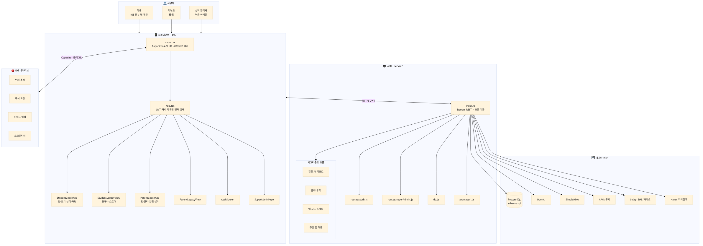

### 0.2 클라이언트 라우팅 — JWT·해시 라우트·학생/학부모 탭

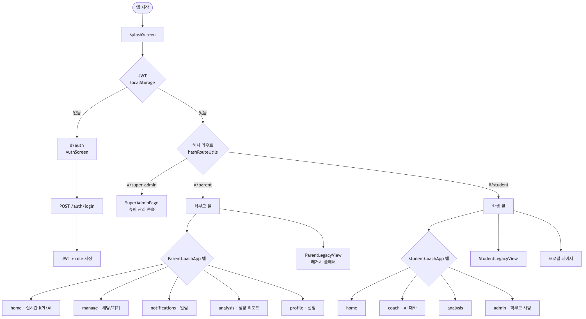

### 0.3 API 맵 — `/auth`, `/api/student`, `/api/parent`, 공통, 슈퍼관리

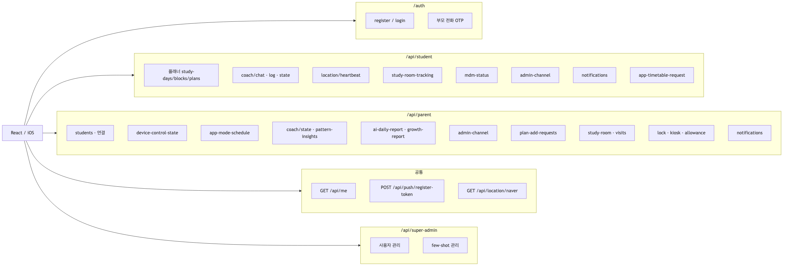

### 0.4 데이터 도메인 — 계정·플래너·코치·리포트·MDM·독서실·알림

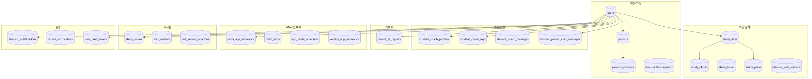

### 0.5 학생 여정 — 플래너·AI 코치·위치·채팅

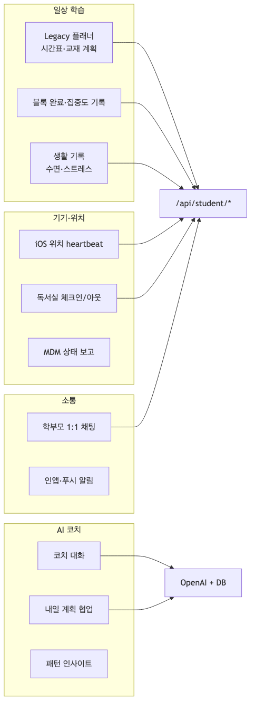

### 0.6 학부모 여정 — 홈·기기 제어·리포트·운영

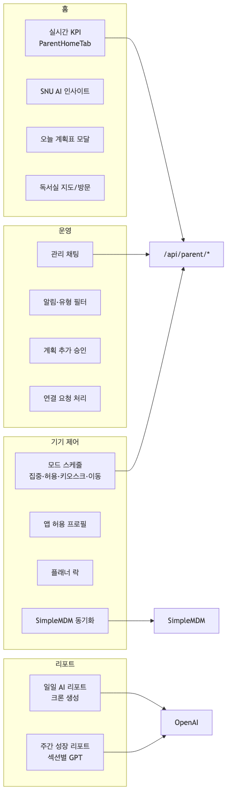

### 0.7 백그라운드 크론 — 일일 리포트·락·MDM·모드 스케줄

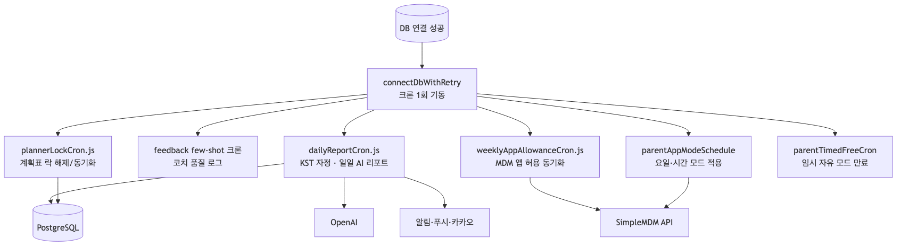

### 0.8 iOS 브리지 — Capacitor 플러그인 ↔ Swift ↔ API

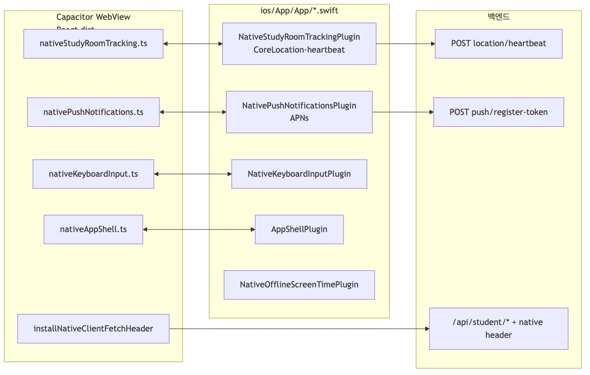

### 0.9 요청 생명주기 — UI → JWT → Express → DB / AI / 외부

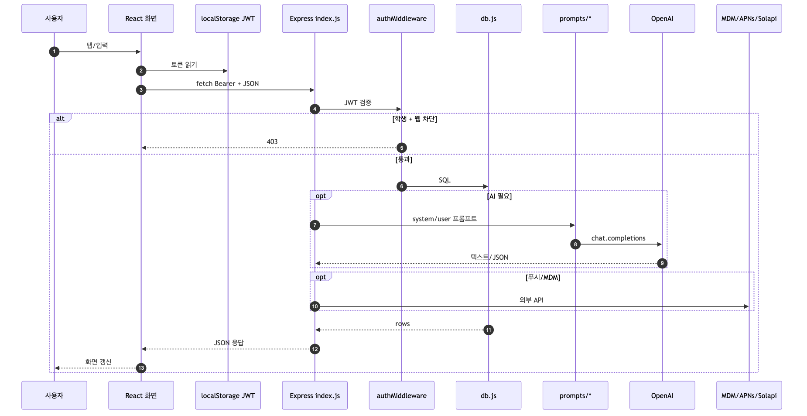

### 0.10 빌드·배포 — Vite → Capacitor → Xcode, 서버·환경 변수

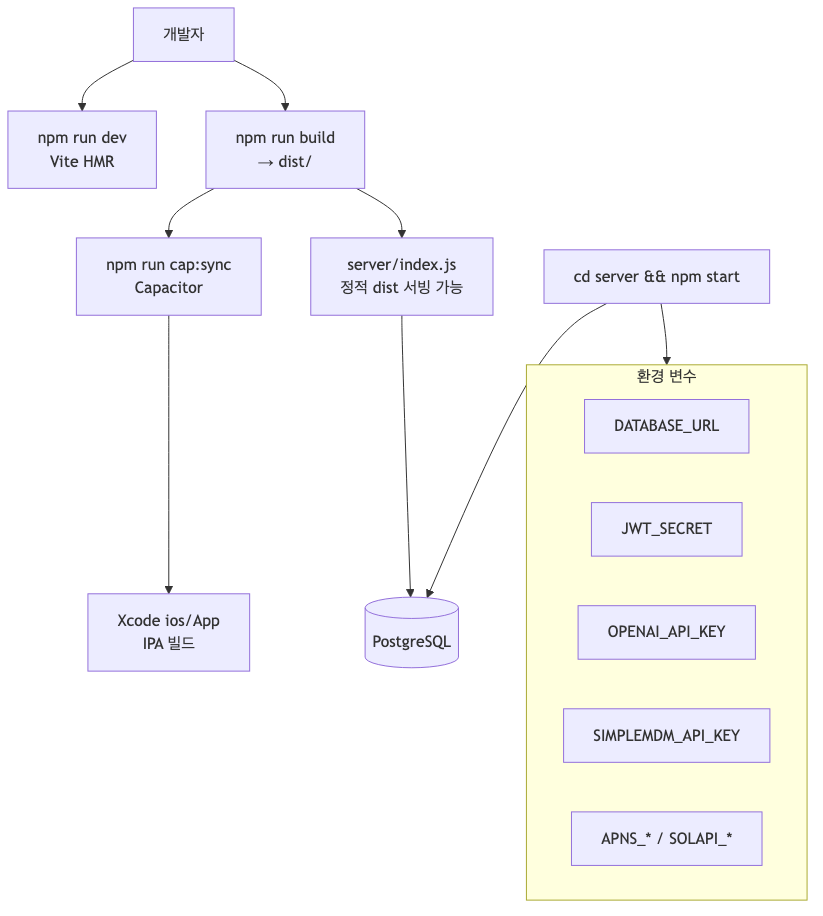

---

## 1. 프로그램이 하는 일

대치루트는 **학생·학부모를 연결한 학습 관리 플랫폼**입니다.

| 대상 | 핵심 기능 |
|------|-----------|
| **학생** | 일정·계획표, AI 코치 대화, 생활·학습 기록, 독서실 위치 체크인, 앱 사용 제한(MDM 연동) |
| **학부모** | 자녀 학습 현황·AI 일일/주간 리포트, 기기·모드 제어, 1:1 채팅, 알림 |
| **슈퍼 관리자** | 허용 이메일 기반 운영 콘솔(사용자·코치 few-shot 관리) |

운영 모델은 **React 웹 UI + Capacitor iOS 앱(번들 내장)** 이 **Node.js API**를 호출하고, **PostgreSQL**에 상태를 저장하는 구조입니다.

---

## 2. 기술 스택

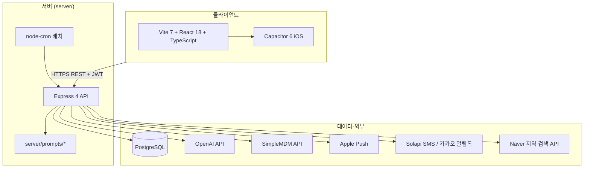

| 계층 | 기술 | 주요 경로 |
|------|------|-----------|
| 프론트 | React, Vite, Framer Motion, Recharts, Leaflet | `src/` |
| 모바일 | Capacitor iOS, Swift 플러그인 | `ios/App/`, `capacitor.config.ts` |
| API | Node.js ≥18, Express | `server/index.js` |
| DB | `pg` Pool | `server/db.js`, `server/schema.sql` |
| 인증 | JWT(HS256), bcrypt | `server/routes/auth.js` |
| AI | OpenAI Chat Completions | `server/prompts/`, `server/aiReportService.js` |

---

## 3. 전체 시스템 구조

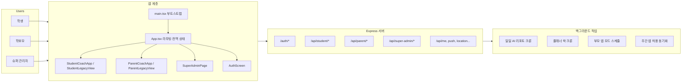

### 요청 흐름(일반 API)

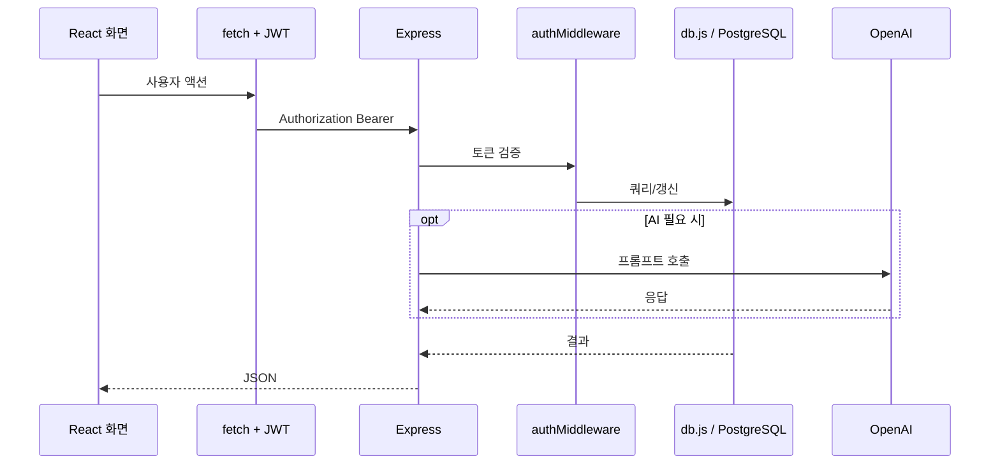

---

## 4. 클라이언트 구조

### 4.1 부트스트랩

| 단계 | 파일 | 설명 |
|------|------|------|
| 1 | `src/main.tsx` | Capacitor/키보드 설정, MDM App Config로 API URL 주입, 네이티브 fetch 헤더 설치 |
| 2 | `src/lib/apiBase.ts` | API 베이스 URL 결정 |
| 3 | `src/lib/installNativeClientFetchHeader.ts` | iOS 앱에 `X-Daechi-Client: native` 부착 |
| 4 | `src/App.tsx` | 로그인·역할·해시 라우트에 따라 전체 UI 분기 |

### 4.2 라우팅(해시 기반)

URL 해시(`#/...`)로 화면을 전환합니다. 유틸: `src/lib/hashRouteUtils.ts`, `src/lib/appNavigation.ts`.

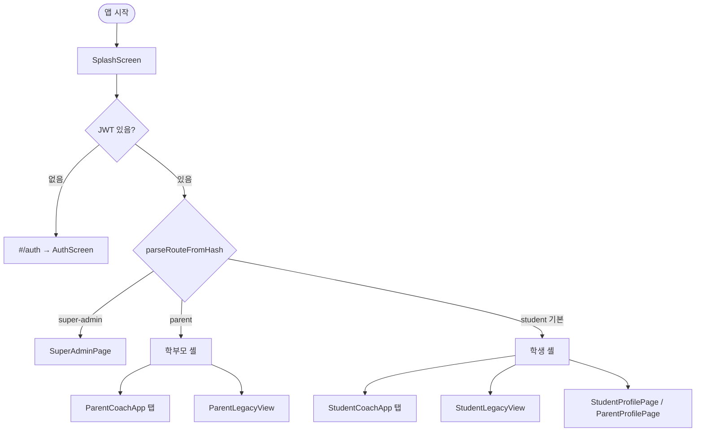

**학생 코치 탭** (`StudentCoachApp`): 홈·코치·분석·관리(학부모 채팅) 등  
**학부모 코치 탭** (`ParentCoachApp`): 홈·관리(채팅)·알림·분석·프로필 등

### 4.3 화면 계층

| 영역 | 경로 | 역할 |
|------|------|------|
| 공통 UI | `src/components/` | 인증, 프로필, 알림, DatePicker, 하단 탭 |
| 코치 UI | `src/coach/student/`, `src/coach/parent/` | AI 코칭·홈·성장 리포트·기기 제어 |
| 레거시 | `*LegacyView.tsx` | 주간 플래너·스토어 등 기존 플로우 |
| 슈퍼 관리 | `src/superAdmin/` | 운영자 콘솔 |
| 문자열 | `src/coach/fallbacks/ko.json` | UI·폴백 한국어 |
| 상태 | `App.tsx` useState + `src/coach/state/useCoachStore.ts` | 전역·코치 채팅 UI 일부 |

### 4.4 클라이언트 캐시

| 방식 | 위치 | 용도 |
|------|------|------|
| JWT | `localStorage` (`daechi_planner_token`) | 세션 |
| 뷰 캐시 TTL | `src/lib/viewCache.ts` | 코치 상태·패턴·스토어 앱 목록 등 |
| sessionStorage | 예: `AdminChannelPanels` | 관리 채널 메시지 임시 캐시 |
| 알람 설정 | `src/lib/studentAlarmSettings.ts` | 학생 알림 on/off 로컬 |

---

## 5. 서버 구조

### 5.1 진입점

- **`server/index.js`**: Express 앱 생성, **대부분의 REST 라우트**, 미들웨어, 크론 기동, 정적 파일(프로덕션 시 `dist` 서빙 가능)
- **`server/db.js`**: PostgreSQL 쿼리 함수(수천 줄, 도메인별 export)
- **`server/package.json`**: 서버 전용 의존성(openai, pg, jsonwebtoken, multer 등)

### 5.2 모듈화된 라우트만 분리

| 파일 | prefix | 내용 |
|------|--------|------|
| `server/routes/auth.js` | `/auth/*` | 회원가입·로그인·부모 전화 OTP |
| `server/routes/superAdmin.js` | `/api/super-admin/*` | 사용자·알림·푸시 테스트 등 |
| `server/routes/superAdminFewshot.js` | (superAdmin에서 등록) | 코치 few-shot 예시 관리 |

그 외 API는 **`server/index.js`에 인라인**으로 정의되어 있습니다.

### 5.3 인증·권한

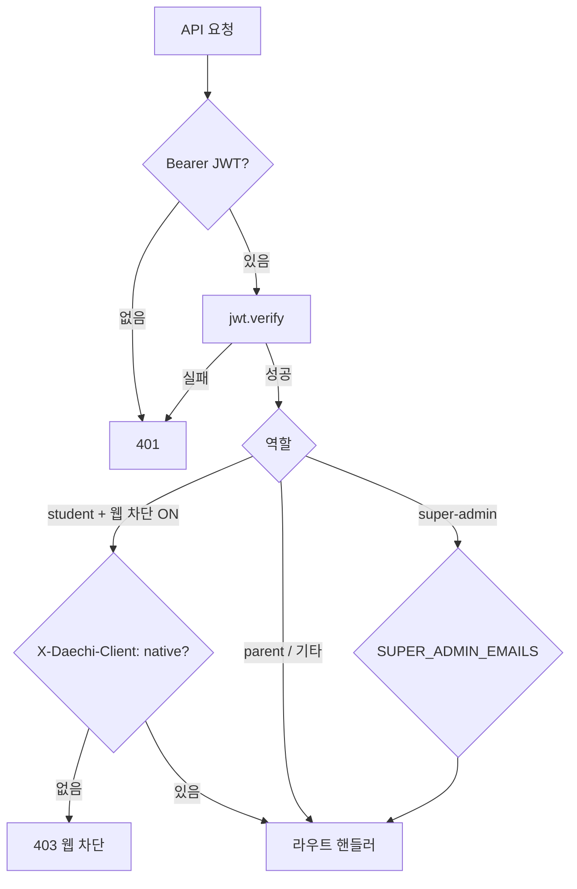

- **학생 웹 차단**: 운영 설정 시 브라우저에서 학생 API 호출 불가, iOS 앱만 허용
- **슈퍼 관리자**: DB role이 아니라 환경변수 허용 이메일 (`server/superAdminAuth.js`)

### 5.4 API 도메인 맵(요약)

| Prefix | 주요 기능 |
|--------|-----------|
| `/auth/*` | 계정 생성·로그인 |
| `/api/me`, `/api/account*` | 프로필·비밀번호 |
| `/api/student/*` | 플래너, 코치 채팅, 기록, 스터디룸 heartbeat, MDM 상태, 알림 |
| `/api/parent/*` | 자녀 목록, 기기 제어, 모드 스케줄, AI/성장 리포트, 관리 채널, 계획 승인 요청 |
| `/api/push/register-token` | APNs 디바이스 토큰 |
| `/api/location/naver/local-search` | 독서실 장소 검색 프록시 |
| `/api/super-admin/*` | 운영 콘솔 |

### 5.5 AI 프롬프트 모듈 (`server/prompts/`)

| 모듈 | 용도 |
|------|------|
| `studentCoachChat.js` | 학생 코치 대화 |
| `studentCoachAnalysis.js` | 학생 분석 |
| `parentDailyAiReport.js` | 부모 일일 AI 리포트 |
| `parentGrowthReport.js` | 부모 주간 성장 리포트(섹션별) |
| `patternInsights.js` | 학습 패턴 인사이트 |
| `appAllowanceTomorrowPlan.js` | 앱 허용·내일 계획 연계 |
| `koFallbackLoader.js` | 서버측 한국어 폴백 로드 |

---

## 6. 데이터베이스 구조

스키마 정의: `server/schema.sql`  
접근 계층: `server/db.js` (함수 단위 export)

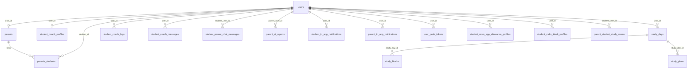

### 도메인별 테이블 그룹

| 도메인 | 대표 테이블 |
|--------|-------------|
| 계정·가족 | `users`, `parents`, `parents_students`, `parent_student_link_requests`, `parent_coach_customizations` |
| 학습 플래너 | `study_days`, `study_blocks`, `study_books`, `study_plans`, `planner_lock_sessions` |
| 코치·채팅 | `student_coach_profiles`, `student_coach_logs`, `student_coach_messages`, `student_parent_chat_messages` |
| 리포트 | `parent_ai_reports` |
| MDM·앱 제어 | `student_mdm_*`, `student_weekly_app_allowance_slots`, `parent_student_app_mode_schedules` |
| 독서실 | `parent_student_study_rooms`, `parent_student_study_room_visit_sessions`, `student_last_known_locations` |
| 알림 | `student_in_app_notifications`, `parent_in_app_notifications`, `user_push_tokens` |

---

## 7. 역할별 주요 기능 흐름

### 7.1 로그인·연결

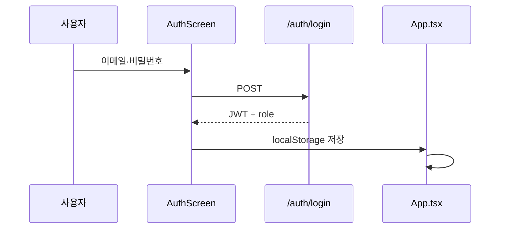

학부모–학생 **연결/해제**는 `parent_student_link_requests`, `parent_student_unlink_requests` 및 관련 API·알림으로 처리합니다.

### 7.2 학생 AI 코치

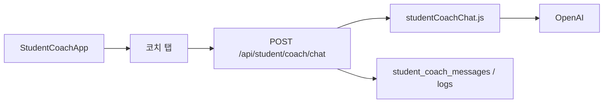

부가: 내일 계획 협업(`CoachTomorrowPlanCollab`), 패턴 인사이트, 분석 탭 등.

### 7.3 학부모 홈·리포트

| 기능 | UI | API / 배치 |
|------|-----|------------|
| 실시간 KPI·인사이트 | `ParentHomeTab`, `ParentHomeInsight` | `GET /api/parent/coach/state` |
| 일일 AI 리포트 | 홈 카드 | `parent_ai_reports`, `dailyReportCron.js` |
| 주간 성장 리포트 | `ParentGrowthReportTab` | `GET /api/parent/growth-report`, `parentGrowthReport.js` |
| 오늘 계획표 | `ParentHomeTodayPlanModal` | 플래너·키오스크 연동 |

### 7.4 학부모–학생 1:1 채팅(관리 채널)

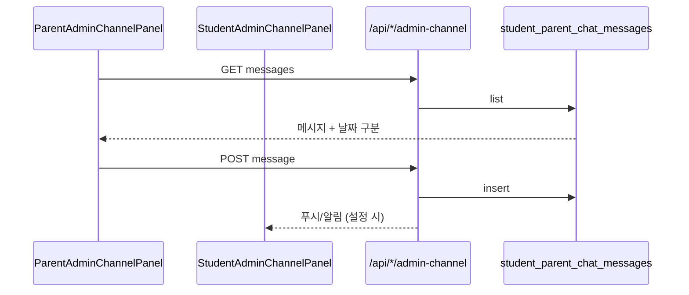

프론트: `src/coach/admin/AdminChannelPanels.tsx`

### 7.5 독서실 위치 추적

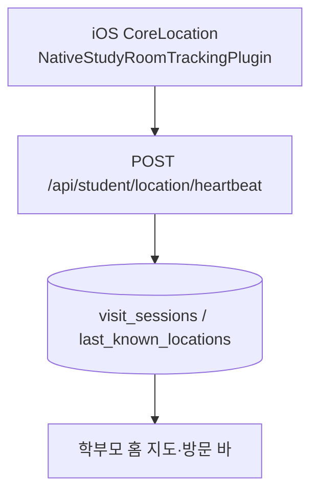

학부모가 독서실 반경·좌표를 설정: `parent_student_study_rooms`.

### 7.6 MDM·기기 모드·앱 허용

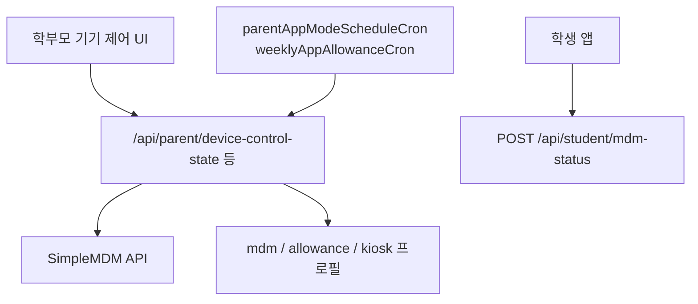

모드 예: 집중(차단), 허용 앱, 키오스크(계획표), 이동(utility), 자유 등 — `parentDeviceModeDisplay.ts`.

### 7.7 알림

| 종류 | 저장 | 발송 |
|------|------|------|
| 인앱 | `*_in_app_notifications` | API로 목록·읽음 처리 |
| 푸시 | `user_push_tokens` + `pushService.js` | APNs |
| 카카오(선택) | — | `parentKakaoNotify.js` / Solapi |

학부모 알림 페이지: 유형 필터(`parentNotificationCategory.ts`) + 승인 대기(`ParentNotificationsPending.tsx`).

---

## 8. 백그라운드 작업(서버 크론)

DB 연결 성공 후 `server/index.js`의 `connectDbWithRetry()`에서 **한 번만** 기동합니다.

| 작업 | 모듈 | 설명 |
|------|------|------|
| 일일 AI 리포트 | `dailyReportCron.js` | 연결된 학부모–학생 쌍, KST 자정 근처 생성 |
| Few-shot 피드백 | `index.js` 내 `startFeedbackFewshotCron` | 코치 품질 신호 수집 |
| 플래너 락 | `plannerLockCron.js` | 계획표 작성 세션 잠금 |
| 주간 앱 허용 | `weeklyAppAllowanceCron.js` | MDM 앱 허용 프로필 동기화 |
| 부모 앱 모드 스케줄 | `parentAppModeSchedule.js` | 요일·시간대별 모드 적용 |
| 부모 timed free | `parentTimedFreeCron.js` | 임시 자유 모드 만료 복구 |

---

## 9. iOS 네이티브 연동

Capacitor 플러그인 (`ios/App/App/`):

| Swift | 역할 |
|-------|------|
| `NativeStudyRoomTrackingPlugin` | 백그라운드 위치·heartbeat |
| `NativePushNotificationsPlugin` | APNs 토큰 |
| `NativeKeyboardInputPlugin` | 네이티브 입력 시트 |
| `NativeOfflineScreenTimePlugin` | 스크린타임/차단 상태 노출 |
| `AppShellPlugin` | 웹뷰·네트워크 UI |
| MDM App Config | 관리형 설치 시 API URL 주입 |

빌드: `npm run mobile:ios` → `dist` 번들을 iOS에 동기화.

---

## 10. 디렉터리 가이드

```
rootDaechi_app/
├── src/                    # 프론트엔드 (React)
│   ├── App.tsx             # 전역 셸·라우팅·인증 상태
│   ├── main.tsx            # 엔트리·Capacitor 초기화
│   ├── coach/              # 코치 UI (학생/학부모)
│   ├── components/         # 공통·레거시 화면
│   ├── lib/                # API·캐시·네이티브 브리지
│   └── superAdmin/         # 운영 콘솔
├── server/                 # 백엔드 API
│   ├── index.js            # Express 메인·대부분 라우트
│   ├── db.js               # DB 접근
│   ├── schema.sql          # 스키마
│   ├── prompts/            # OpenAI 프롬프트
│   ├── routes/             # auth, superAdmin
│   └── *Cron.js, *Service.js
├── ios/App/                # Xcode / Swift 플러그인
├── public/                 # 정적 자산
├── docs/                   # 운영·설계 문서
├── dist/                   # Vite 빌드 산출물 (Capacitor webDir)
└── package.json            # 프론트 의존성·스크립트
```

---

## 11. 환경 변수(서버 요약)

`server/.env.example` 참고. 대표 항목:

| 변수 | 용도 |
|------|------|
| `DATABASE_URL` | PostgreSQL |
| `JWT_SECRET` | API 토큰 |
| `OPENAI_API_KEY` | 코치·리포트 AI |
| `SIMPLEMDM_API_KEY` | 기기·앱 제어 |
| `APNS_*` | iOS 푸시 |
| `SOLAPI_*` | SMS·카카오 알림톡 |
| `NAVER_SEARCH_*` | 장소 검색 |
| `SUPER_ADMIN_EMAILS` | 슈퍼 관리자 허용 목록 |

프론트: `VITE_API_BASE` (개발 시 API 서버 주소).

---

## 12. 로컬 실행 요약

| 목적 | 명령 |
|------|------|
| 프론트 개발 | `npm install && npm run dev` |
| 프론트 빌드 | `npm run build` |
| 서버 | `cd server && npm install && npm run migrate && npm start` |
| iOS | `npm run mobile:ios` |

---

## 13. 문서 갱신 시 참고

- **모식도 PNG**: `docs/diagrams/png/` (소스 `.mmd`, 재생성 `npm run docs:diagrams`)
- **모식도 HTML 뷰어**: `docs/SYSTEM_ARCHITECTURE_DIAGRAMS.html`
- 프롬프트 전문 목록: `docs/COACH_PROMPTS_AND_KO_INVENTORY.md`
- Capacitor/iOS: `docs/CAPACITOR.md`
- 카카오 알림톡: `docs/KAKAO_ALIMTALK_TEMPLATES.md`

이 문서는 **2026-05-17** 기준 `main` 브랜치 코드 구조를 반영했습니다. API가 `index.js`에 집중되어 있으므로, 세부 엔드포인트는 해당 파일 또는 `rg "app\.(get|post)" server/index.js`로 확인하는 것이 가장 정확합니다.
